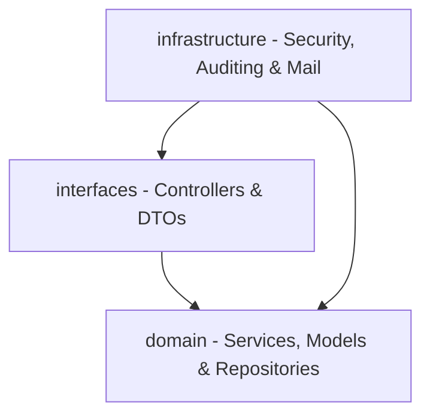

# VidaPlena API Backend


O **VidaPlena** é uma API RESTful de saúde digital completa e robusta desenvolvida para a orquestração e o gerenciamento de prontuários eletrônicos, agendamentos clínicos, controle de dependências familiares, monitoramento de vínculos institucionais (empresas e clínicas) e fluxo completo de auditoria para registros médicos.

---

## 🏗️ Arquitetura do Sistema

A API segue os princípios do **Domain-Driven Design (DDD)** e da **Clean Architecture**, dividindo-se de forma clara em três camadas fundamentais:



*   **`interfaces`**: Responsável pela exposição dos endpoints HTTP, roteamento e validação inicial de payload.
    *   `controller`: Controladores REST anotados com as permissões de acesso (RBAC).
    *   `dto`: Objetos de Transferência de Dados com anotações de validação (`jakarta.validation`).
*   **`domain`**: Contém as regras de negócio puras, entidades do modelo relacional e interfaces de persistência.
    *   `model`: Entidades JPA que espelham o esquema relacional.
    *   `repository`: Interfaces que estendem `JpaRepository`.
    *   `service`: Camada de serviço contendo a inteligência de negócios.
*   **`infrastructure`**: Módulos de suporte técnico e segurança.
    *   `auditing`: Integração do Spring Data JPA Auditing para registrar metadados de criação e modificação em entidades auditáveis.
    *   `security`: Filtros e serviços JWT para controle stateless e RBAC.
    *   `mail`: Comunicação SMTP estruturada ou logging para depuração em desenvolvimento.

---

## 🛠️ Tecnologias Utilizadas

*   **Linguagem:** Java 21 (JDK LTS)
*   **Framework Base:** Spring Boot 4.1.0 (Web, Data JPA, Security, Mail, Validation)
*   **Persistência & ORM:** Hibernate 7 / JPA (com pooling HikariCP)
*   **Migração de Banco:** Flyway (com suporte a PostgreSQL)
*   **Banco de Dados:** PostgreSQL 16 (Produção/Docker) e H2 Database (Testes Unitários/Integração)
*   **Autenticação:** JSON Web Tokens (JJWT 0.11.5)
*   **Orquestração:** Docker & Docker Compose
*   **Documentação:** Springdoc OpenAPI / Swagger UI 2.5.0

---

## 💾 Banco de Dados & Migrações (Flyway)

A evolução do banco de dados é gerenciada incrementalmente por arquivos de migração localizados em `src/main/resources/db/migration/`.

---

## 🔐 Segurança e Autenticação (RBAC)

O controle de acesso é realizado de forma **stateless** utilizando **tokens JWT** trafegados no header `Authorization: Bearer <TOKEN>`. Os papéis de acesso (`TipoUsuario`) mapeados são:
*   `ADMINISTRADOR`: Permissão irrestrita (gerenciamento de usuários, clínicas e empresas).
*   `PACIENTE`: Acesso ao próprio perfil, histórico de agendamentos e prontuários.
*   `RESPONSAVEL`: Gerenciamento de prontuários de seus dependentes.
*   `MEDICO`, `NUTRICIONISTA`, `PERSONAL_TRAINER`: Profissionais habilitados para lançar atendimentos, prontuários e retificações.
*   `FUNCIONARIO_ADMINISTRATIVO`: Gestão operacional de agendamentos.
*   `CUIDADOR`, `REPRESENTANTE_EMPRESA`: Perfis operacionais e corporativos específicos.

---

## 📖 Documentação da API (Swagger / OpenAPI)

A API VidaPlena utiliza o **Springdoc OpenAPI** para gerar de forma automatizada a especificação dos endpoints e fornecer uma interface gráfica interativa para testes rápidos de integração.

### URLs de Acesso (Ambiente Local)
*   **Swagger UI (Interface Gráfica):** [http://localhost:8080/swagger-ui/index.html](http://localhost:8080/swagger-ui/index.html) (ou [http://localhost:8080/swagger-ui.html](http://localhost:8080/swagger-ui.html) que redirecionará automaticamente).
*   **Documentação OpenAPI (JSON):** [http://localhost:8080/v3/api-docs](http://localhost:8080/v3/api-docs)

### Configuração em Produção
Por questões de segurança, a documentação Swagger vem **desabilitada por padrão** no perfil de produção (`prod`). 

Para expor o Swagger UI em ambientes produtivos ou de homologação externa, configure as seguintes variáveis de ambiente no arquivo `.env` ou no container Docker:
```properties
SPRINGDOC_API_DOCS_ENABLED=true
SPRINGDOC_SWAGGER_UI_ENABLED=true
```

---

## ⚙️ Variáveis de Ambiente e Configuração

O sistema suporta injeção de parâmetros via variáveis de ambiente. Abaixo listamos as variáveis configuradas em [application-prod.yml]

| Variável | Descrição | Valor Padrão / Exemplo |
| :--- | :--- | :--- |
| `PORT` | Porta HTTP da aplicação | `8080` |
| `SERVER_CONTEXT_PATH` | Caminho de contexto base da API | `/` |
| `SPRING_DATASOURCE_URL` | URL de conexão PostgreSQL | `jdbc:postgresql://db:5432/vidaplena` |
| `SPRING_DATASOURCE_USERNAME` | Usuário do banco de dados | `vidaplena` |
| `SPRING_DATASOURCE_PASSWORD` | Senha do banco de dados | `vidaplena_secure_password_2026` |
| `SPRING_DATASOURCE_HIKARI_MAX_POOL_SIZE`| Máximo de conexões no Pool Hikari | `20` |
| `VIDAPLENA_JWT_SECRET` | Chave secreta de criptografia do token JWT | `vidaplena-super-secret-production-key-for-jwt-signing-2026` |
| `VIDAPLENA_JWT_EXPIRATION` | Tempo de expiração do JWT (padrão ISO-8601)| `PT2H` (2 horas) |
| `VIDAPLENA_MAIL_ENABLED` | Habilitar envio de e-mails via SMTP | `false` |
| `SPRING_MAIL_HOST` | Host do servidor SMTP | `smtp.gmail.com` |
| `SPRING_MAIL_PORT` | Porta do servidor SMTP | `587` |
| `SPRING_MAIL_USERNAME` | Usuário do servidor SMTP | `seu-email@gmail.com` |
| `SPRING_MAIL_PASSWORD` | Senha do servidor SMTP | `sua-senha-app` |
| `SPRINGDOC_API_DOCS_ENABLED` | Expor Swagger JSON em `/v3/api-docs` | `false` |
| `SPRINGDOC_SWAGGER_UI_ENABLED` | Expor Swagger UI em `/swagger-ui.html` | `false` |

---

## 🚀 Como Executar o Projeto

### Pré-requisitos
*   Java Development Kit (JDK) 21 instalado.
*   Maven 3.9+ configurado (opcional, wrapper `./mvnw` incluso).
*   Docker e Docker Compose instalados.

### 1. Executando Localmente (Desenvolvimento)
Por padrão, o projeto utilizará as configurações contidas em `src/main/resources/application.yaml`.

```bash
# Limpar compilação e rodar
./mvnw clean spring-boot:run
```

### 2. Rodando Testes Automatizados
Os testes utilizam o banco de dados em memória **H2** e estão isolados por transações.

```bash
# Rodar todos os testes unitários e de integração
./mvnw clean test
```

### 3. Compilação de Produção
Para compilar o artefato `.jar` de forma standalone:

```bash
./mvnw clean package -DskipTests
```
O arquivo gerado estará localizado em `target/vidaplena-0.0.1-SNAPSHOT.jar`.

---

## 🐳 Executando com Docker

O projeto possui um fluxo de build Docker multi-stage configurado no [Dockerfile] (Maven + Eclipse Temurin JRE Alpine) visando leveza e segurança (rodando sob usuário não-root `spring:spring`).

### Comandos Úteis do Docker Compose:

```bash
# 1. Compilar as imagens e subir os contêineres em background
docker compose up --build -d

# 2. Verificar os logs da aplicação em tempo real
docker compose logs -f app

# 3. Verificar o status e healthcheck dos contêineres
docker compose ps

# 4. Parar os contêineres e apagar os volumes de dados persistidos
docker compose down -v
```

---
